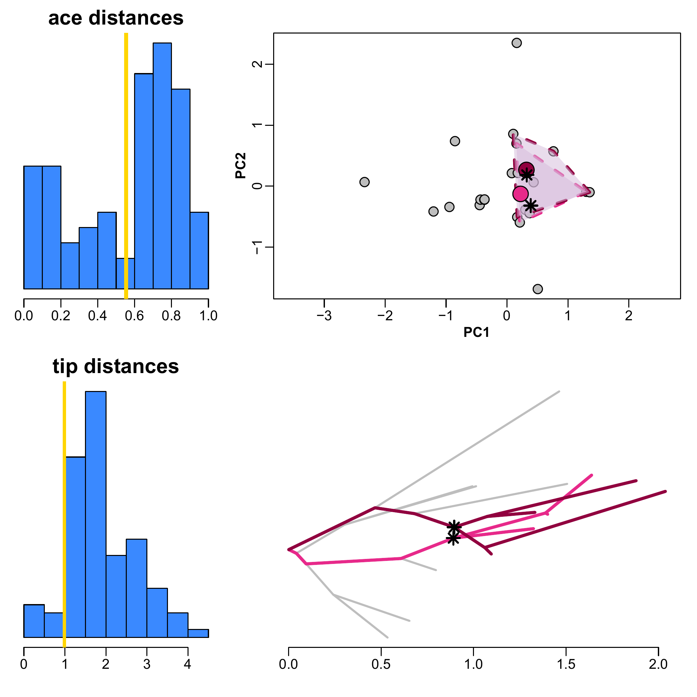

```{r, include = FALSE}
knitr::opts_chunk$set(
  collapse = TRUE,
  comment = "#>"
)

require(RRphylo)
require(rgl)

options(knitr.kable.NA = '',mc.cores=2,rgl.useNULL=TRUE,
        rmarkdown.html_vignette.check_title = FALSE)

```

## Index
1. [search.conv basics](#basics)
2. [Morphological convergence between clades](#nodes)
3. [Morphological convergence within/between categories](#state)
4. [Guided examples](#examples)


## search.conv basics {#basics}
Dealing with multivariate data, each species at the tree tips is represented by a phenotypic vector, including one entry value for each variable. Naming $A$ and $B$ the phenotypic vectors of a given pair of species in the tree, the angle $θ$ between them is computed as the inverse cosine of the ratio between the dot product of $A$ and $B$, and the product of vectors sizes: 
$$θ = arccos(\frac{A•B}{|A||B|})$$ The cosine of angle $θ$ actually represents the correlation coefficient between the two vectors. As such, it exemplifies a measure of phenotypic resemblance. Possible $θ$ values span from 0° to 180°. Small angles (i.e. close to 0˚) imply similar phenotypes. At around 90˚ the phenotypes are dissimilar, whereas towards 180˚ the two phenotypic vectors point in opposing directions (i.e. the two phenotypes have contrasting values for each variable). For a phenotype with $n$ variables, the two vectors intersect at a vector of $n$ zeros. 

```{r include=FALSE}
require(RRphylo)
require(RColorBrewer)
require(rgl)
require(ape)
require(phytools)
require(geiger)
require(mvMORPH)

theta<-function(a,b){
  unitV <- function(x) {
    sum(x^2)^0.5
  }
  deg2rad <- function(deg) {
    (deg * pi)/(180)
  }
  rad2deg <- function(rad) {
    (rad * 180)/(pi)
  }
  rad2deg(acos((a%*%b)/(unitV(a) *unitV(b))))->theta
  return(theta)
}

veclen <- function(v) sqrt(sum(v^2))
xprod <- function(v, w) c( v[2]*w[3] - v[3]*w[2],
                           v[3]*w[1] - v[1]*w[3],
                           v[1]*w[2] - v[2]*w[1] )

arc3d <- function(from, to, center, radius, n, circle = 50, base = 0, plot = TRUE, ...) {
  fixarg <- function(arg) {
    if (is.matrix(arg))
      arg[, 1:3, drop = FALSE]
    else
      matrix(arg, 1, 3)
  }
  normalize <- function(v)
    v / veclen(v)
  getrow <- function(arg, i) {
    arg[1 + (i - 1) %% nrow(arg),]
  }
  from <- fixarg(from)
  to <- fixarg(to)
  center <- fixarg(center)

  m <- max(nrow(from), nrow(to), nrow(center), length(base))
  base <- rep_len(base, m)

  result <- matrix(NA_real_, nrow = 1, ncol = 3)

  for (j in seq_len(m)) {
    from1 <- getrow(from, j)
    to1 <- getrow(to, j)
    center1 <- getrow(center, j)
    base1 <- base[j]
    logr1 <- log(veclen(from1 - center1))
    logr2 <- log(veclen(to1 - center1))
    A <- normalize(from1 - center1)
    B <- normalize(to1 - center1)
    steps <- if (base1 <= 0) 4*abs(base1) + 1 else 4*base1 - 1
    for (k in seq_len(steps)) {
      if (k %% 2) {
        A1 <- A * (-1)^(k %/% 2)
        B1 <- B * (-1)^(k %/% 2 + (base1 > 0))
      } else {
        A1 <- B * (-1)^(k %/% 2 + (base1 <= 0))
        B1 <- A * (-1)^(k %/% 2)
      }
      theta <- acos(sum(A1*B1))
      if (isTRUE(all.equal(theta, pi)))
        warning("Arc ", j, " points are opposite each other!  Arc is not well defined.")
      if (missing(n))
        n1 <- ceiling(circle*theta/(2*pi))
      else
        n1 <- n

      if (missing(radius)) {
        pretheta <- (k %/% 2)*pi - (k %% 2 == 0)*theta
        if (k == 1)
          totaltheta <- (steps %/% 2)*pi - (steps %% 2 == 0)*theta + theta
        p1 <- pretheta/totaltheta
        p2 <- (pretheta + theta)/totaltheta
        radius1 <- exp(seq(from = (1 - p1)*logr1 + p1*logr2,
                           to   = (1 - p2)*logr1 + p2*logr2,
                           length.out = n1 + 1))
      } else
        radius1 <- rep_len(radius, n1)
      arc <- matrix(NA_real_, nrow = n1 + 1, ncol = 3)
      p <- seq(0, 1, length.out = n1 + 1)
      arc[1,] <- center1 + radius1[1]*A1
      arc[n1 + 1,] <- center1 + radius1[n1 + 1]*B1
      AB <- veclen(A1 - B1)
      for (i in seq_len(n1)[-1]) {
        ptheta <- p[i]*theta
        phi <- pi/2 + (0.5 - p[i])*theta
        q <- (sin(ptheta) / sin(phi))/AB
        D <- (1-q)*A1 + q*B1
        arc[i,] <- center1 + radius1[i] * normalize(D)
      }
      if (k == 1)
        result <- rbind(result, arc)
      else
        result <- rbind(result[-nrow(result), ,drop = FALSE], arc)
    }
    result <- rbind(result, result[1,])
  }
  if (plot)
    lines3d(result[c(-1, -nrow(result)), , drop = FALSE], ...)
  else
    result[c(-1, -nrow(result)), , drop = FALSE]
}

### creating a phylogenetic tree with 100 species
set.seed(14)
rtree(50)->tree

### select, extract and then modify the clade to be duplicated
dist.nodes(tree)[(Ntip(tree)+1),]->cd
cd[cd<0.8*max(cd)]->cd
cd[which(as.numeric(names(cd))>Ntip(tree))]->cd
cdt<-array()
for(e in 1:length(cd)) length(tips(tree,names(cd)[e]))->cdt[e]
names(cd[-which(cdt<Ntip(tree)*.1|cdt>Ntip(tree)/4)])->cd
cdd<-array()
for(i in 1:length(cd)){
  if((length(tips(tree,cd[i]))-2)>(length(tips(tree,cd[i]))+Ntip(tree)-2)*0.1) cdd[i]<-"ok" else cdd[i]<-"no"
}
if(length(which(cdd=="ok"))>0) cd[which(cdd=="ok")]->cd else cd->cd
as.numeric(sample(cd,1))->n

extract.clade(tree,n)->t1
max(nodeHeights(t1))->nH1
suppressWarnings(swapONE(t1)[[1]]->t1)
drop.tip(t1,t1$tip.label[c(1,length(t1$tip.label))])->t1

if(max(nodeHeights(t1))!=nH1) geiger:::rescale(t1,nH1,model = "depth")->t1

t1$root.edge<-data.frame(tree$edge,tree$edge.length)[which(
  data.frame(tree$edge,tree$edge.length)[,2]==n),3]


### selecting the node where the new clade is to be binded
distNodes(tree,n)[1:Nnode(tree),]->dfN
dfN[-which(rownames(dfN)%in%c(n,getDescendants(tree,n))),]->dfN
distNodes(tree,(Ntip(tree)+1))[1:Nnode(tree),][-1,]->dR
dR[match(rownames(dfN),rownames(dR)),]->dR1
dfN[match(rownames(dR1)[which(dR1[,2]<max(dR[,2])*0.8)],rownames(dfN)),]->dfN
rownames(dfN)[which(dfN[,1]<=Ntip(tree)/10)]->bar
dfN[-which(dfN[,1]<=Ntip(tree)/10),]->dfn2


if(!inherits(dfn2,"matrix")){
  t(as.matrix(dfn2))->dfn2
  rownames(dfN)[-which(dfN[,1]<=Ntip(tree)/10)]->rownames(dfn2)
}

if(dim(dfn2)[1]==0){
  rownames(dfN)[which.max(dfN[,1])]->nodN
  dfN[which.max(dfN[,1]),1]->minD
} else{
  dR[match(rownames(dfn2),rownames(dR)),]->dfn3
  if(!inherits(dfn3,"matrix")){
    t(as.matrix(dfn3))->dfn3
    rownames(dR)[match(rownames(dfn2),rownames(dR))]->rownames(dfn3)
  }
  rownames(dfn3)[which.min(dfn3[,2])]->nodN
  dfn2[rownames(dfn2)==nodN,1]->minD
}
nodN->tar

at<-tar
data.frame(tree$edge,tree$edge.length)[which(data.frame(tree$edge,
                                                        tree$edge.length)[,2]==at),3]->pos
diff(dist.nodes(tree)[(Ntip(tree)+1),c(n,tar)])->dH
if(dH>0) {
  geiger:::rescale(t1,(abs(diff(c(max(nodeHeights(t1)),dH)))),model = "depth")->t1
  t1$root.edge+pos/2->t1$root.edge
}else{
  geiger:::rescale(t1,(max(nodeHeights(t1))+abs(dH)),model = "depth")->t1
  t1$root.edge+pos/2->t1$root.edge
}

tree->treeO
t1->t1O

```

However, it is important to note that with geometric morphometric data (PC scores) the origin coincides with the consensus shape (where all PC scores are 0), so that, for instance, a large $θ$ indicates the two species diverge from the consensus in opposite directions and the phenotypic vectors can be visualized in the PC space (see the figures below). 

```{r noconv, webgl=TRUE,echo=FALSE,fig.width=6,fig.height=6,fig.align="center",message=FALSE,warning=FALSE}
set.seed(93)
tree$tip.label<-paste("a",seq(1,Ntip(tree)),sep="")
t1$tip.label<-paste("a",seq((Ntip(tree)+1),(Ntip(tree)+Ntip(t1))),sep="")
bind.tree(tree,t1,where=at,position=pos/2)->tree1
ntraits<-3
thetaX=c(0,0,0)
matrix(c(1,0.5,0.5,0.5,1,0.5,.5,.5,1),3,3)->sigma
mvSIM(tree1,param=list(ntraits=ntraits,theta=thetaX,sigma=sigma))->y
c(getMRCA(tree1,tree$tip.label[which(tree$tip.label%in%tips(tree,n))]),
  getMRCA(tree1,t1$tip.label))->nod.par
apply(y,2,function(x) fastAnc(tree1,x))->ant
y[c(sample(tips(tree1,nod.par[1]),1),sample(tips(tree1,nod.par[2]),1)),]->y.vec
match(rownames(y.vec),tree1$tip.label)->aa

apply(y[tips(tree1,nod.par[1]),],2,mean)->y.vec[1,]
apply(y[tips(tree1,nod.par[2]),],2,mean)->y.vec[2,]
matrix(c(0,0,0),1,3)->rV

rep("gray80",length(y))->coltips
coltips[match(tips(tree1,nod.par[1]),rownames(y))]<-"firebrick1"
coltips[match(tips(tree1,nod.par[2]),rownames(y))]<-"deepskyblue1"
plot3d(y,col=coltips,size=1,bbox=FALSE,axes=FALSE,box=FALSE,type="s")
box3d()
title3d(xlab="y[,1]",ylab="y[,2]",zlab="y[,3]")
plot3d(rV,col="green",add=TRUE,size=2,bbox=FALSE,axes=FALSE,box=FALSE,type="s")
plot3d(ant,col="gray16",size=1,bbox=FALSE,axes=TRUE,box=FALSE,add=TRUE,type="s")
text3d(matrix(ant[match(nod.par[1],rownames(ant)),],1,3),texts="mrca1",add=TRUE,adj=1,cex=1,col="red4")
text3d(matrix(ant[match(nod.par[2],rownames(ant)),],1,3),texts="mrca2",add=TRUE,adj=1,cex=1,col="blue3")


segments3d(rbind(rV,matrix(ant[match(nod.par[1],rownames(ant)),],1,3)),col="red4",lwd=4)
segments3d(rbind(rV,matrix(ant[match(nod.par[2],rownames(ant)),],1,3)),col="blue3",lwd=4)
segments3d(rbind(rV,y.vec[2,]),col="deepskyblue1",lwd=4)
segments3d(rbind(rV,y.vec[1,]),col="firebrick1",lwd=4)

matrix(ant[match(nod.par[1],rownames(ant)),],1,3)->a
matrix(ant[match(nod.par[2],rownames(ant)),],1,3)->b
theta(c(a),c(b))->theta.ace
as.numeric(round(theta.ace,1))->theta.ace
veclen(a)->la
veclen(b)->lb
if(la>lb) (la/lb)*b->b else (lb/la)*a->a
if(la<.5*lb) segments3d(rbind(matrix(ant[match(nod.par[1],rownames(ant)),],1,3),(lb/la)*matrix(ant[match(nod.par[1],rownames(ant)),],1,3)))
if(la>.5*lb) segments3d(rbind(matrix(ant[match(nod.par[2],rownames(ant)),],1,3),(la/lb)*matrix(ant[match(nod.par[2],rownames(ant)),],1,3)))


veclen(a)->la
arc3d(a,b,rV,add=TRUE,col="red",radius=.5*la)
arc3d(b,a,rV,add=TRUE,col="red",radius=.5*la)

text3d(rV,texts=paste("theta.ace",theta.ace),adj=c(-.5,.5),col="red")

matrix(y.vec[1,],1,3)->at1
matrix(y.vec[2,],1,3)->at2
theta(c(at1),c(at2))->theta.real
as.numeric(round(theta.real,1))->theta.real
veclen(at1)->lat1
veclen(at2)->lat2
if(lat1>lat2) (lat1/lat2)*at2->at2 else (lat2/lat1)*at1->at1
if(lat1<.5*lat2) segments3d(rbind(matrix(y.vec[1,],1,3),(lat2/lat1)*matrix(y.vec[1,],1,3))) 
if(lat2<.5*lat1) segments3d(rbind(matrix(y.vec[2,],1,3),(lat1/lat2)*matrix(y.vec[2,],1,3)))
veclen(at1)->lat1
arc3d(at1,at2,rV,add=TRUE,col="blue",radius=.5*lat1)
arc3d(at2,at1,rV,add=TRUE,col="blue",radius=.5*lat1)
text3d(rV,texts=paste("theta.tips",theta.real),adj=c(-.5,lat1),col="blue")

range(y[,3])->ran
if(ran[1]<0) ran[1]*0.9->ran[1] else ran[1]*1.1->ran[1]
if(ran[2]<0) ran[2]*1.1->ran[2] else ran[2]*0.9->ran[2]


points3d(matrix(c(rep(range(y[,1])[2]*1.5,5),rep(range(y[,3])[1]*1.2,5),seq(ran[1],ran[2],length.out=5)),5,3,byrow=FALSE),
         col=c("gray80","gray16","green","firebrick1","deepskyblue1","blue3","red4"),size=8)
text3d(matrix(c(rep(range(y[,1])[2]*1.6,5),rep(range(y[,3])[1]*1.2,5),seq(ran[1],ran[2],length.out=5)),5,3,byrow=FALSE),
       texts=c("phenotypes at tips","phenotypes at nodes","origin","clade 2","clade 1"),adj=c(0,0.5),cex=1.2)

rglwidget(elementId = "plot3drgl")
```

Under the Brownian Motion (BM) model of evolution, the phenotypic dissimilarity between any two species in the tree (hence the $θ$ angle between them) is expected to grow proportionally to their phylogenetic distance. In the figure above, the mean directions of phenotypic change from the consensus shape formed by the species in two distinct clades (in light colors) diverge by a large angle (represented by the blue arc). This angle is expected to be larger than the angle formed by the direction of phenotypic change calculated at the ancestors of the two clades (the red arc).

```{r simpleconv, webgl=TRUE,echo=FALSE,fig.width=6,fig.height=6,fig.align="center",message=FALSE,warning=FALSE}
set.seed(14)
treeO->tree
t1O->t1
ntraits<-3
thetaX=c(0,0,0)
matrix(c(1,0.5,0.5,0.5,1,0.5,.5,.5,1),3,3)->sigma
mvSIM(tree,param=list(ntraits=ntraits,theta=thetaX,sigma=sigma))->y
y[match(tree$tip.label,rownames(y)),]->y
y[match(tips(tree,n),rownames(y)),]->a


apply(y,2,range)->m.a
m.a[2,]*1.2->m.a

a1<-matrix(ncol=dim(y)[2],nrow=dim(a)[1])
for(m in 1:dim(a)[1])
{
  v<-array()
  for(i in 1:length(m.a)) jitter(m.a[i],amount=(sd(a[,i])*1))->v[i]
  v->a1[m,]
}

rownames(a1)<-rownames(a)
y[match(tips(tree,n),rownames(y)),]<-a1

apply(y[match(t1$tip.label,rownames(y)),],2,jitter)->y.t1

tree$tip.label<-paste("a",seq(1,Ntip(tree)),sep="")
t1$tip.label<-paste("a",seq((Ntip(tree)+1),(Ntip(tree)+Ntip(t1))),sep="")
rownames(y)<-tree$tip.label
rownames(y.t1)<-t1$tip.label
bind.tree(tree,t1,where=at,position=pos/2)->tree1
rbind(y,y.t1)->y

### nod.par is the node pair set to converge
c(getMRCA(tree1,tree$tip.label[which(tree$tip.label%in%tips(tree,n))]),
  getMRCA(tree1,t1$tip.label))->nod.par
apply(y,2,function(x) fastAnc(tree1,x))->ant
y[c(sample(tips(tree1,nod.par[1]),1),sample(tips(tree1,nod.par[2]),1)),]->y.vec
match(rownames(y.vec),tree1$tip.label)->aa


apply(y[tips(tree1,nod.par[1]),],2,mean)->y.vec[1,]
apply(y[tips(tree1,nod.par[2]),],2,mean)->y.vec[2,]
matrix(c(0,0,0),1,3)->rV

rep("gray80",length(y))->coltips
coltips[match(tips(tree1,nod.par[1]),rownames(y))]<-"firebrick1"
coltips[match(tips(tree1,nod.par[2]),rownames(y))]<-"deepskyblue1"
plot3d(y,col=coltips,size=1,bbox=FALSE,axes=FALSE,box=FALSE,type="s")
box3d()
title3d(xlab="y[,1]",ylab="y[,2]",zlab="y[,3]")
plot3d(rV,col="green",add=TRUE,size=2,bbox=FALSE,axes=FALSE,box=FALSE,type="s")
plot3d(ant,col="gray16",size=1,bbox=FALSE,axes=TRUE,box=FALSE,add=TRUE,type="s")
text3d(matrix(ant[match(nod.par[1],rownames(ant)),],1,3),texts="mrca1",add=TRUE,adj=1,cex=1,col="red4")
text3d(matrix(ant[match(nod.par[2],rownames(ant)),],1,3),texts="mrca2",add=TRUE,adj=1,cex=1,col="blue3")


segments3d(rbind(rV,matrix(ant[match(nod.par[1],rownames(ant)),],1,3)),col="red4",lwd=4)
segments3d(rbind(rV,matrix(ant[match(nod.par[2],rownames(ant)),],1,3)),col="blue3",lwd=4)
segments3d(rbind(rV,y.vec[2,]),col="deepskyblue1",lwd=4)
segments3d(rbind(rV,y.vec[1,]),col="firebrick1",lwd=4)

matrix(ant[match(nod.par[1],rownames(ant)),],1,3)->a
matrix(ant[match(nod.par[2],rownames(ant)),],1,3)->b
theta(c(a),c(b))->theta.ace
as.numeric(round(theta.ace,1))->theta.ace
veclen(a)->la
veclen(b)->lb
if(la>lb) (la/lb)*b->b else (lb/la)*a->a
if(la<.5*lb) segments3d(rbind(matrix(ant[match(nod.par[1],rownames(ant)),],1,3),(lb/la)*matrix(ant[match(nod.par[1],rownames(ant)),],1,3)))
if(la>.5*lb) segments3d(rbind(matrix(ant[match(nod.par[2],rownames(ant)),],1,3),(la/lb)*matrix(ant[match(nod.par[2],rownames(ant)),],1,3)))


veclen(a)->la
arc3d(a,b,rV,add=TRUE,col="red",radius=.5*la)
arc3d(b,a,rV,add=TRUE,col="red",radius=.5*la)

text3d(rV,texts=paste("theta.ace",theta.ace),adj=c(-.5,.5),col="red")

matrix(y.vec[1,],1,3)->at1
matrix(y.vec[2,],1,3)->at2
theta(c(at1),c(at2))->theta.real
as.numeric(round(theta.real,1))->theta.real
veclen(at1)->lat1
veclen(at2)->lat2
if(lat1>lat2) (lat1/lat2)*at2->at2 else (lat2/lat1)*at1->at1
if(lat1<.5*lat2) segments3d(rbind(matrix(y.vec[1,],1,3),(lat2/lat1)*matrix(y.vec[1,],1,3))) 
if(lat2<.5*lat1) segments3d(rbind(matrix(y.vec[2,],1,3),(lat1/lat2)*matrix(y.vec[2,],1,3)))
veclen(at1)->lat1
arc3d(at1,at2,rV,add=TRUE,col="blue",radius=.5*lat1)
arc3d(at2,at1,rV,add=TRUE,col="blue",radius=.5*lat1)
text3d(rV,texts=paste("theta.tips",theta.real),adj=c(-.5,lat1),col="blue")

range(y[,3])->ran
if(ran[1]<0) ran[1]*0.9->ran[1] else ran[1]*1.1->ran[1]
if(ran[2]<0) ran[2]*1.1->ran[2] else ran[2]*0.9->ran[2]


points3d(matrix(c(rep(range(y[,1])[2]*1.5,5),rep(range(y[,3])[1]*1.2,5),seq(ran[1],ran[2],length.out=5)),5,3,byrow=FALSE),
         col=c("gray80","gray16","green","firebrick1","deepskyblue1","blue3","red4"),size=8)
text3d(matrix(c(rep(range(y[,1])[2]*1.6,5),rep(range(y[,3])[1]*1.2,5),seq(ran[1],ran[2],length.out=5)),5,3,byrow=FALSE),
       texts=c("phenotypes at tips","phenotypes at nodes","origin","clade 2","clade 1"),adj=c(0,0.5),cex=1.2)
rglwidget(elementId = "plot3drgl1")
```

Under convergence, the expected positive relationship between phylogenetic and phenotypic distances is violated and the mean angle between the species of the two clades will be shallow. 

```{r conv&par, webgl=TRUE,echo=FALSE,fig.width=6,fig.height=6,fig.align="center",message=FALSE,warning=FALSE}
set.seed(14)
treeO->tree
t1O->t1

ntraits<-3
thetaX=c(0,0,0)
matrix(c(1,0.5,0.5,0.5,1,0.5,.5,.5,1),3,3)->sigma
mvSIM(tree,param=list(ntraits=ntraits,theta=thetaX,sigma=sigma))->y
y[match(tree$tip.label,rownames(y)),]->y
y[match(tips(tree,n),rownames(y)),]->a


apply(y,2,range)->m.a
sample(seq(.8,1.2,.1),1)->ff
m.a[2,]*ff->m.a

a1<-matrix(ncol=dim(y)[2],nrow=dim(a)[1])
for(m in 1:dim(a)[1])
{
  v<-array()
  for(i in 1:length(m.a)) jitter(m.a[i],amount=(sd(a[,i])*1))->v[i]
  v->a1[m,]
}

rownames(a1)<-rownames(a)
y[match(tips(tree,n),rownames(y)),]<-a1

apply(y[match(t1$tip.label,rownames(y)),],2,jitter)->y.t1

tree$tip.label<-paste("a",seq(1,Ntip(tree)),sep="")
t1$tip.label<-paste("a",seq((Ntip(tree)+1),(Ntip(tree)+Ntip(t1))),sep="")
rownames(y)<-tree$tip.label
rownames(y.t1)<-t1$tip.label
bind.tree(tree,t1,where=at,position=pos/2)->tree1
rbind(y,y.t1)->y

c(getMRCA(tree1,tree$tip.label[which(tree$tip.label%in%tips(tree,n))]),
  getMRCA(tree1,t1$tip.label))->nod.par
apply(y,2,function(x) fastAnc(tree1,x))->ant

### sample one tip descending from each node set to converge
y[c(sample(tips(tree1,nod.par[1]),1),sample(tips(tree1,nod.par[2]),1)),]->y.vec
match(rownames(y.vec),tree1$tip.label)->aa

### modify the phenotypes at the mrcas (nod.par) as the median of the distribution of phenotypes of descending tips   
apply(y[tips(tree1,nod.par[1]),],2,median)->mrca.1
ant[match(nod.par[1],rownames(ant)),]<-mrca.1
apply(y[tips(tree1,nod.par[2]),],2,median)->mrca.2
ant[match(nod.par[2],rownames(ant)),]<-mrca.2


apply(y[tips(tree1,nod.par[1]),],2,mean)->y.vec[1,]
apply(y[tips(tree1,nod.par[2]),],2,mean)->y.vec[2,]
matrix(c(0,0,0),1,3)->rV

rep("gray80",length(y))->coltips
coltips[match(tips(tree1,nod.par[1]),rownames(y))]<-"firebrick1"
coltips[match(tips(tree1,nod.par[2]),rownames(y))]<-"deepskyblue1"
plot3d(y,col=coltips,size=1
       ,bbox=FALSE,axes=FALSE,box=FALSE,type="s")
box3d()
title3d(xlab="y[,1]",ylab="y[,2]",zlab="y[,3]")
plot3d(rV,col="green",add=TRUE,size=2,bbox=FALSE,axes=FALSE,box=FALSE,type="s")
plot3d(ant,col="gray16",size=1,bbox=FALSE,axes=TRUE,box=FALSE,add=TRUE,type="s")
text3d(matrix(ant[match(nod.par[1],rownames(ant)),],1,3),texts="mrca1",add=TRUE,adj=1,cex=1,col="red4")
text3d(matrix(ant[match(nod.par[2],rownames(ant)),],1,3),texts="mrca2",add=TRUE,adj=1,cex=1,col="blue3")


segments3d(rbind(rV,matrix(ant[match(nod.par[1],rownames(ant)),],1,3)),col="red4",lwd=4)
segments3d(rbind(rV,matrix(ant[match(nod.par[2],rownames(ant)),],1,3)),col="blue3",lwd=4)
segments3d(rbind(rV,y.vec[2,]),col="deepskyblue1",lwd=4)
segments3d(rbind(rV,y.vec[1,]),col="firebrick1",lwd=4)

matrix(ant[match(nod.par[1],rownames(ant)),],1,3)->a
matrix(ant[match(nod.par[2],rownames(ant)),],1,3)->b
theta(c(a),c(b))->theta.ace
as.numeric(round(theta.ace,1))->theta.ace
veclen(a)->la
veclen(b)->lb
if(la>lb) (la/lb)*b->b else (lb/la)*a->a
if(la<.5*lb) segments3d(rbind(matrix(ant[match(nod.par[1],rownames(ant)),],1,3),(lb/la)*matrix(ant[match(nod.par[1],rownames(ant)),],1,3)))
if(la>.5*lb) segments3d(rbind(matrix(ant[match(nod.par[2],rownames(ant)),],1,3),(la/lb)*matrix(ant[match(nod.par[2],rownames(ant)),],1,3)))


veclen(a)->la
arc3d(a,b,rV,add=TRUE,col="red",radius=.5*la)
arc3d(b,a,rV,add=TRUE,col="red",radius=.5*la)

text3d(rV,texts=paste("theta.ace",theta.ace),adj=c(-.5,.5),col="red")

matrix(y.vec[1,],1,3)->at1
matrix(y.vec[2,],1,3)->at2
theta(c(at1),c(at2))->theta.real
as.numeric(round(theta.real,1))->theta.real
veclen(at1)->lat1
veclen(at2)->lat2
if(lat1>lat2) (lat1/lat2)*at2->at2 else (lat2/lat1)*at1->at1
if(lat1<.5*lat2) segments3d(rbind(matrix(y.vec[1,],1,3),(lat2/lat1)*matrix(y.vec[1,],1,3))) 
if(lat2<.5*lat1) segments3d(rbind(matrix(y.vec[2,],1,3),(lat1/lat2)*matrix(y.vec[2,],1,3)))
veclen(at1)->lat1
arc3d(at1,at2,rV,add=TRUE,col="blue",radius=.5*lat1)
arc3d(at2,at1,rV,add=TRUE,col="blue",radius=.5*lat1)
text3d(rV,texts=paste("theta.tips",theta.real),adj=c(-.5,lat1),col="blue")

range(y[,3])->ran
if(ran[1]<0) ran[1]*0.9->ran[1] else ran[1]*1.1->ran[1]
if(ran[2]<0) ran[2]*1.1->ran[2] else ran[2]*0.9->ran[2]


points3d(matrix(c(rep(range(y[,1])[2]*1.5,5),rep(range(y[,3])[1]*1.2,5),seq(ran[1],ran[2],length.out=5)),5,3,byrow=FALSE),
         col=c("gray80","gray16","green","firebrick1","deepskyblue1","blue3","red4"),size=8)
text3d(matrix(c(rep(range(y[,1])[2]*1.6,5),rep(range(y[,3])[1]*1.2,5),seq(ran[1],ran[2],length.out=5)),5,3,byrow=FALSE),
       texts=c("phenotypes at tips","phenotypes at nodes","origin","clade 2","clade 1"),adj=c(0,0.5),cex=1.2)
rglwidget(elementId = "plot3drgl2")
```

One particular case of convergence applies when species in the two clades start from similar ancestral phenotypes and tend to remain similar, on average, despite the passing of evolutionary time. These parallel trajectories are evident in the figure above, representing two clades evolving towards the same mean phenotype.

The function `search.conv` (Castiglione et al. 2019) is specifically meant to calculate $θ$ values and to test whether actual $θ$s between groups of species are smaller than expected by their phylogenetic distance. The function tests for convergence in either entire clades or species grouped under different evolutionary ‘states’.


## Morphological convergence between clades {#nodes}
When convergence between clades is tested, the user indicates the clade pair supposed to converge by setting the argument `node`. Otherwise, the function automatically scans the phylogeny searching for significant instance of convergent clades. In this case, the minimum distance (meant as either number of nodes or evolutionary time), and the maximum and minimum sizes (in term of number of tips) for the clades to be tested are pre-set within the function or indicated by the user through the arguments `min.dist`, `max.dim`, and `min.dim`, respectively.  

Given two monophyletic clades (subtrees) $C1$ and $C2$, `search.conv` computes the mean angle $θ_{real}$ over all possible combinations of pairs of species taking one species per clade. This $θ_{real}$ is divided by the patristic (i.e. the sum of branch lengths) distance between the most recent common ancestors (mrcas) to $C1$ and $C2$, $mrcaC1$ and $mrcaC2$, respectively, to account for the fact that the mean angle (hence the phenotypic distance) is expected to increase, on average, with phylogenetic distance. To assess significance, `search.conv` randomly takes a pair of tips from the tree ($t1$ and $t2$), computes the angle $θ_{random}$ between their phenotypes and divides $θ_{random}$ by the distance between $t1$ and $t2$ respective immediate ancestors (i.e. the distance between the first node $N1$ above $t1$, and the first node $N2$ above $t2$). This procedure is repeated 1,000 times generating $θ_{random}$ per unit time values, directly from the tree and data. The $θ_{random}$ per unit time distribution is used to test whether $θ_{real}$ divided by the distance between $mrcaC1$ and $mrcaC2$ is statistically significant, meaning if it is smaller than 5% of $θ_{random}$ values the two clades are said to converge.

With `seach.conv`, it is also possible to test for the initiation of convergence. In fact, given a pair of candidate clades under testing, the phenotypes at $mrcaC1$ and $mrcaC2$ are estimated by `RRphylo`, and the angle between the ancestral states ($θ_{ace}$) is calculated. Then, $θ_{ace}$ is added to $θ_{real}$ and the resulting sum divided by the distance between $mrcaC1$ and $mrcaC2$. The sum $θ_{ace} + θ_{real}$ should be small for clades evolving from similar ancestors towards similar daughter phenotypes. Importantly, a small $θ_{ace}$ means similar phenotypes at the mrcas of the two clades, whereas a small $θ_{real}$ implies similar phenotypes between their descendants. It does not mean, though, that the mrcas have to be similar to their own descendants. Two clades might, in principle, start with certain phenotypes and both evolve towards a similar phenotype which is different from the initial shape. This means that the two clades literally evolve along parallel trajectories. Under `search.conv`, simple convergence is distinguished by such instances of convergence with parallel evolution. The former is tested by looking at the significance of $θ_{real}$. The latter is assessed by testing whether the quantity $θ_{ace} + θ_{real}$ is small (at alpha = 0.05) compared to the distribution of the same quantity generated by summing the $θ_{random}$ calculated for each randomly selected pair of species $t1$ and $t2$ plus the angle between the phenotypic estimates at their respective ancestors $N1$ and $N2$ divided by their distance.

```{r echo=FALSE,fig.width=5,fig.height=6,fig.align="center",message=FALSE,warning=FALSE,out.width='60%',dpi=200}
rad2deg <- function(rad) (rad * 180)/(pi)
unitV <- function(x) sum(x^2)^0.5

set.seed(22)
rtree(14)->tree
getDescendants(tree,18)->des1
getDescendants(tree,24)->des2
c(18,getMommy(tree,18))->mom1
c(24,getMommy(tree,24))->mom2
mom1[-length(mom1)]->mom1
mom2[-length(mom2)]->mom2
colo<-rep("gray50",length(tree$edge.length))
colo[which(tree$edge[,2]%in%des1)]<-"deepskyblue1"
colo[which(tree$edge[,2]%in%des2)]<-"firebrick1"
colo[which(tree$edge[,2]%in%c(mom1,mom2))]<-"black"

wid<-rep(3,length(tree$edge.length))
wid[which(tree$edge[,2]%in%mom1)]<-4
wid[which(tree$edge[,2]%in%mom2)]<-4

set.seed(14)
fastBM(tree,nsim=3)->y

apply(y[tips(tree,18)[1:3],],2,function(x) jitter(x,2))->y[tips(tree,24),]

RRphylo(tree,y,clus=2/parallel::detectCores())->RR
rbind(RR$aces,y)->phen
tree->tree1

c(18,24)->nod
dist.nodes(tree1)[nod[1],nod[2]]->nT
tips(tree1,nod[1])->tt1
tips(tree1,nod[2])->TT
expand.grid(tt1,TT)->ctt
aa<-array()
for(g in 1:dim(ctt)[1]){
  phen[match(c(as.character(ctt[g,1]),as.character(ctt[g,2])),rownames(phen)),]->ppTT
  as.matrix(ppTT)->ppTT
  aa[g] <- rad2deg(acos((ppTT[1,]%*%ppTT[2,])/(unitV(ppTT[1,]) *unitV(ppTT[2,]))))
}
mean(aa)->ang.tip

RR$aces[which(rownames(RR$aces)%in%nod),]->ac
rad2deg(acos((ac[1,] %*% ac[2,])/(unitV(ac[1,]) *unitV(ac[2,]))))->ang.ac

apply(ctt,2,as.character)->ctt
rbind(c("$\\theta_{real}$", "=",round(ang.tip,3)),c(paste("$\\theta_{real}$","+","$\\theta_{ace}$",sep=""),"=",round(ang.tip+ang.ac,3)),c("$distance_{mrcas}$","=",round(nT,3)))->abc
as.data.frame(rbind(cbind(ctt,round(aa,3)),c("mrcaC-18","mrca-24",round(ang.ac,3)),abc))->angs
colnames(angs)<-c("clade18","clade24","angle")

col2hex <- function(col, alpha) rgb(t(col2rgb(col)), alpha=alpha, maxColorValue=255)
require(kableExtra)
knitr::kable(angs,digits=3,align="c") %>%
  kable_styling(full_width = F, position = "float_right")  %>%
  column_spec(1, color = col2hex("deepskyblue1"),bold=TRUE) %>%
  column_spec(2, color = col2hex("firebrick1"),bold=TRUE) %>%
  pack_rows("", 14, 16) %>%
  row_spec(14:16, color = "black",bold=TRUE)

plot(tree,no.margin = TRUE,direction="downward",srt=90,adj=0.5,edge.color = colo,edge.width = wid)
nodelabels(node=c(18,24),text=c("mrcaC1","mrcaC2"),bg="w",frame="n",adj=c(-0.1,-0.2),font=2)
nodelabels(bg="w",frame="n",adj=c(0.5,1.2),font=2)
legend("bottomright",legend=c("Clade 18","Clade 24","mrca-18 to mrca-24 distance"),
       lty=1,col=c("deepskyblue1","firebrick1","black"),lwd=c(3,3,4))

```
$$\frac{\theta_{real}}{dist_{mrcas}} = 17.286 ; \frac{\theta_{real}+\theta_{ace}}{dist_{mrcas}} = 31.242$$ 


Regardless of whether clades are indicated (by the argument `node`) or not (i.e. the function automatically locates convergent clades), `search.conv` returns the metrics (i.e. $θ_{real}$, $θ_{ace}$ and so on) and the relative significance level for each clade pair under testing (`$node pairs`). 
```{r message=FALSE, warning=FALSE,eval=FALSE}
search.conv(RR=RR,y=y,min.dim=3,max.dim=4,nsim=100,rsim=100,
            clus=2/parallel::detectCores(),filename="convergence plot")->SC
```
```{r message=FALSE, warning=FALSE,echo=FALSE}
pdf.options(useDingbats=FALSE)
# search.conv(RR=RR,y=y,min.dim=3,max.dim=4,nsim=100,rsim=100,
#             clus=2/parallel::detectCores(),foldername=getwd())->SC
RR=RR;y=y;min.dim=3;max.dim=4;min.dist=NULL;nsim=100;rsim=100;foldername=getwd()

{
  require(ape)
  require(geiger)
  require(phytools)
  require(vegan)
  require(cluster)
  require(plotrix)
  require(geomorph)
  
  traitgram = function(
  x, phy,
  xaxt='s',
  underscore = FALSE,
  show.names = TRUE,
  show.xaxis.values = TRUE,
  method = c('ML','pic'),
  col=NULL,
  lwd=NULL,
  mgp=NULL,...)
{

  method <- match.arg(method)
  Ntaxa = length(phy$tip.label)
  Ntot = Ntaxa + phy$Nnode
  phy = picante::node.age(phy)
  ages = phy$ages[match(1:Ntot,phy$edge[,2])]
  ages[Ntaxa+1]=0


  if (class(x) %in% c('matrix','array')) {
    xx = as.numeric(x)
    names(xx) = row.names(x)
  } else xx = x

  if (!is.null(names(xx))) {
    umar = 0.1
    if (!all(names(xx) %in% phy$tip.label)) {
      print('trait and phy names do not match')
      return()
    }
    xx = xx[match(phy$tip.label,names(xx))]
  } else umar = 0.1

  lmar = 0.2
  if (xaxt=='s') if (show.xaxis.values) lmar = 1 else lmar = 0.5
  xanc <- ape::ace(xx, phy, method=method)$ace
  xall = c(xx,xanc)

  a0 = ages[phy$edge[,1]]
  a1 = ages[phy$edge[,2]]
  x0 = xall[phy$edge[,1]]
  x1 = xall[phy$edge[,2]]


  if (show.names) {
    maxNameLength = max(nchar(names(xx)))
    ylim = c(min(ages),max(ages)*(1+maxNameLength/50))
    if (!underscore) names(xx) = gsub('_',' ',names(xx))
  } else ylim = range(ages)

  if(is.null(mgp)) magp<-NULL else{
    mgp->magp
  }

  if(is.null(col)) colo<-par("fg") else{
    col->colo
    colo[match(names(x1),names(colo))]->colo
    data.frame(x0,x1,a0,a1,colo)->dato
    dato[order(dato[,5],decreasing=TRUE),]->dato
    dato[,1]->x0
    dato[,2]->x1
    dato[,3]->a0
    dato[,4]->a1
    as.character(dato[,5])->colo
    rownames(dato)->names(x1)->names(x0)->names(a1)->names(a0)->names(colo)
  }

  par(mar = c(3, 2.5, 2, 1))
  plot(range(c(a0,a1)),range(c(x0,x1)),

       type='n',xaxt='n',yaxt='n',
       xlab='',ylab='',bty='n',cex.axis=0.8)
  if (xaxt=='s') if (show.xaxis.values) axis(1,labels=TRUE,mgp=magp) else axis(1,labels=FALSE,mgp=magp)

  if(is.null(lwd)) linwd<-1 else{
    lwd->linwd
    linwd[match(names(x1),names(linwd))]->linwd
  }

  segments(a0,x0,a1,x1,col=colo,lwd=linwd)

  if (show.names) {
    text(max(ages),sort(xx),
         labels = names(xx)[order(xx)],
         adj = -0,
         srt=90,
         cex=.3)
  }

  return(data.frame(a1,x1))
}

Plot_ConvexHull<-function(xcoord, ycoord, lcolor,lwd=NULL, lty=NULL,col.p=NULL){
  hpts <- chull(x = xcoord, y = ycoord)
  hpts <- c(hpts, hpts[1])
  lines(xcoord[hpts], ycoord[hpts], col = lcolor,lwd=lwd, lty=lty)
  polygon(xcoord[hpts], ycoord[hpts], col=col.p, border=NA)
}

  
  RR$tree->tree1
  RR$aces->RRaces
  
  y <- treedata(tree1, y, sort = TRUE)[[2]]
  
  RR$tip.path->L
  RR$rates->betas
  RR$node.path->L1
  rbind(RRaces,y)->phen
  
  if(is.null(min.dim)) min.dim<-Ntip(tree1)*0.1 else min.dim<-min.dim
  
  if(is.null(min.dist)) {
    min.dist<-Ntip(tree1)*0.1
    dist.type<-"node"
  }else{
    if(any(grep("time",min.dist))){
      min.dist<-as.numeric(gsub("time","",min.dist))
      dist.type<-"time"
    }else{
      min.dist<-as.numeric(gsub("node","",min.dist))
      dist.type<-"node"
    }
  }
  
  if(is.null(max.dim))  max.dim<-Ntip(tree1)/5 else max.dim<-max.dim
  
  subtrees(tree1)->subT->subTN
  if(length(sapply(subT,Ntip)>max.dim)>0){
    subT[-c(which(sapply(subT,Ntip)<min.dim),which(sapply(subT,Ntip)>max.dim))]->subT
    
  }else{
    subT[-which(unlist(lapply(subT,Ntip))<min.dim)]->subT
  }
  
  sapply(subT,function(x) getMRCA(tree1,x$tip.label))->names(subT)
  as.numeric(names(subT))->nod
  c(nod,Ntip(tree1)+1)->nod
  subT[[length(subT)+1]]<-tree1
  names(subT)[length(subT)]<-Ntip(tree1)+1
  
  RRaces[match(nod,rownames(RR$aces)),]->aces
  
  res<-list()
  # if(round((detectCores() * clus), 0)==0) cl<-makeCluster(1) else cl <- makeCluster(round((detectCores() * clus), 0))
  # registerDoParallel(cl)
  # res <- foreach(i = 1:(length(nod)-1),
  #                .packages = c("ape", "geiger", "phytools", "doParallel")) %dopar%
  #   {
  #     gc()
  for(i in 1:(length(nod)-1)){
    nod[i]->sel1
    tips(tree1,sel1)->tt1
    
    if(length(which(nod%in%getDescendants(tree1,sel1)))>0)
      nod[-which(nod%in%getDescendants(tree1,sel1))]->mean.sel else
        nod->mean.sel
    
    if(length(which(mean.sel%in%getMommy(tree1,sel1)))>0)
      mean.sel[-which(mean.sel%in%getMommy(tree1,sel1))]->mean.sel else
        mean.sel->mean.sel
    mean.sel[-which(mean.sel==sel1)]->mean.sel
    
    if(dist.type=="time") {
      distNodes(tree1,sel1)[1:Nnode(tree1),]->distN
      distN[,2]->matDist
      distN[,1]->matN
    }else{
      distNodes(tree1,sel1)[1:Nnode(tree1),1]->matDist
    }
    
    matDist->matNod
    if (length(which(mean.sel %in% names(matDist[which(matDist<min.dist)])))>0) mean.sel[-which(mean.sel %in% names(matDist[which(matDist<min.dist)]))]->mean.sel else mean.sel->mean.sel
    
    
    if(length(mean.sel)==0) {
      c(dir.diff=NULL,diff=NULL,ang=NULL)->diff.p
      nDD<-NULL
      nTT<-NULL
    }else{
      nDD<-array()
      nTT<-array()
      diff.p<-matrix(ncol=6,nrow=length(mean.sel))
      for(k in 1:length(mean.sel)){
        
        if(dist.type=="time"){
          matN[match(as.numeric(as.character(mean.sel[k])),names(matN))]->nD
          matDist[match(as.numeric(as.character(mean.sel[k])),names(matDist))]->nT
        }else{
          matDist[match(as.numeric(as.character(mean.sel[k])),names(matDist))]->nD
          dist.nodes(tree1)[sel1,as.numeric(mean.sel[k])]->nT
        }
        
        nD->nDD[k]
        nT->nTT[k]
        
        tips(tree1,mean.sel[k])->TT
        expand.grid(tt1,TT)->ctt
        aa<-array()
        for(g in 1:dim(ctt)[1]){
          phen[match(c(as.character(ctt[g,1]),as.character(ctt[g,2])),rownames(phen)),]->ppTT
          as.matrix(ppTT)->ppTT
          aa[g] <- rad2deg(acos((ppTT[1,]%*%ppTT[2,])/(unitV(ppTT[1,]) *unitV(ppTT[2,]))))
        }
        mean(aa)->ang.tip
        
        
        aces[which(rownames(aces)%in%c(sel1,mean.sel[k])),]->ac
        rad2deg(acos((ac[1,] %*% ac[2,])/(unitV(ac[1,]) *unitV(ac[2,]))))->ang.ac
        
        c(dir.diff=ang.tip/nT,diff=(ang.tip+ang.ac)/nT,ang=ang.ac,ang.tip=ang.tip,nD=nD,nT=nT)->diff.p[k,]
        
        
      }
      rownames(diff.p)<-mean.sel
      colnames(diff.p)<-c("ang.bydist.tip","ang.conv","ang.ace","ang.tip","nod.dist","time.dist")
      
    }
    
    diff.p->mean.diff
    
    res[[i]]<-list(matNod,mean.diff,mean.sel,nDD,nTT)
  }
  
  lapply(res,"[[",1)->matNod
  lapply(res,"[[",2)->mean.diff
  lapply(res,"[[",3)->mean.sel
  lapply(res,"[[",4)->nD.sel
  lapply(res,"[[",5)->nT.sel
  
  
  nod[1:(length(nod)-1)]->names(mean.diff)->names(matNod)->names(nD.sel)->names(nT.sel)
  
  sapply(mean.diff,is.null)->nulls
  if(length(which(nulls == TRUE))==length(mean.diff)) stop("There are no nodes distant enough to search convergence, consider using a smaller min.dist")
  
  if(length(which(nulls==TRUE)>0)) mean.diff[-which(nulls==TRUE)]->mean.diff
  if(length(which(nulls==TRUE)>0)) mean.sel[-which(nulls==TRUE)]->mean.sel
  if(length(which(nulls==TRUE)>0)) matNod[-which(nulls==TRUE)]->matNod
  if(length(which(nulls==TRUE)>0)) nD.sel[-which(nulls==TRUE)]->nD.sel
  if(length(which(nulls==TRUE)>0)) nT.sel[-which(nulls==TRUE)]->nT.sel
  
  
  mean.aRd<-array()
  AD<-matrix(ncol=5,nrow=rsim)
  suppressWarnings(for(h in 1:rsim){
    tree1$tip.label[sample(seq(1:length(tree1$tip.label)),2)]->tsam
    
    phen[match(c(as.character(tsam[1]),as.character(tsam[2])),rownames(phen)),]->ppt
    tt <- rad2deg(acos((ppt[1,]%*%ppt[2,])/(unitV(ppt[1,]) *unitV(ppt[2,]))))
    getMommy(tree1,which(tree1$tip.label==as.character(tsam[1])))[1]->n1
    getMommy(tree1,which(tree1$tip.label==as.character(tsam[2])))[1]->n2
    phen[match(c(n1,n2),rownames(phen)),]->pp
    aa <- rad2deg(acos((pp[1,]%*%pp[2,])/(unitV(pp[1,]) *unitV(pp[2,]))))
    
    dist.nodes(tree1)[n1,n2]->dt
    
    
    paste(n1,n2,sep="/")->cb
    c(diff=(aa+tt)/dt,dist=dt,n1=n1,n2=n2,combo=cb)->AD[h,]
    tt/dt->mean.aRd[h]
  })
  
  
  as.data.frame(AD)->AD
  as.numeric(as.character(AD[,1]))->AD[,1]
  as.numeric(as.character(AD[,2]))->AD[,2]
  if(length(which(is.na(AD[,1])))>0){
    which(is.na(AD[,1]))->outs
    AD[-outs,]->AD
    mean.aRd[-outs]->mean.aRd
  }
  
  if(length(which(AD[,1]=="Inf"))>0){
    which(AD[,1]=="Inf")->outs
    AD[-outs,]->AD
    mean.aRd[-outs]->mean.aRd
  }
  
  colnames(AD)<-c("ang.by.dist","dist","n1","n2","combo")
  
  res.ran <- list()
  # cl <- makeCluster(round((detectCores() * clus), 0))
  # registerDoParallel(cl)
  # res.ran <- foreach(k = 1:nsim,
  #                    .packages = c("ape", "geiger", "phytools", "doParallel")) %dopar%
  #   {
  #     gc()
  for(k in 1:nsim){
    mean.diffR<-list()
    for(u in 1:length(mean.diff)){
      names(mean.diff)[[u]]->sel1
      mean.sel[[u]]->msel
      nT.sel[[u]]->ntsel
      diff.pR<-list()
      for(j in 1:length(msel)){
        msel[j]->sel2
        
        as.numeric(names(L1[,which(colnames(L1)==sel1)][which(L1[,which(colnames(L1)==sel1)]!=0)]))[-1]->des
        ldes<-array()
        for(i in 1:length(des)){
          length(which(des%in%getMommy(tree1,des[i])))->ldes[i]
        }
        des[which(ldes<=1)]->des1
        
        as.numeric(names(L1[,which(colnames(L1)==sel2)][which(L1[,which(colnames(L1)==sel2)]!=0)]))[-1]->des
        ldes<-array()
        for(i in 1:length(des)){
          length(which(des%in%getMommy(tree1,des[i])))->ldes[i]
        }
        des[which(ldes<=1)]->des2
        
        expand.grid(c(getMommy(tree1,sel1)[1:2],des1,sel1),c(getMommy(tree1,sel2)[1:2],des2,sel2))->ee
        as.numeric(as.character(ee[,2]))->ee[,2]
        as.numeric(as.character(ee[,1]))->ee[,1]
        ee[,c(2,1)]->e2
        colnames(e2)<-colnames(ee)
        rbind(ee,e2)->ex
        apply(ex,1, function(x) paste(x[1],x[2],sep="/"))->exx
        as.data.frame(exx)->exx
        if (length(which(AD$combo%in%exx[,1]))>0) AD[-which(AD$combo%in%exx[,1]),]->ADD else AD->ADD
        sample(seq(1:dim(ADD)[1]),1)->s
        mean.aRd[s]->rdiff
        ADD[s,1]->mdiff
        data.frame(dir.diff=rdiff,diff=mdiff)->diff.pR[[j]]
        
      }
      do.call(rbind,diff.pR)->mean.diffR[[u]]
      rownames(mean.diffR[[u]])<-names(msel)
    }
    names(mean.diffR)<-names(mean.diff)
    mean.diffR->res.ran[[k]]
    
  }
  
  diff.rank<-list()
  for(i in 1:length(mean.diff)){
    rnk<-matrix(ncol=2,nrow=dim(mean.diff[[i]])[1])
    for(k in 1:dim(mean.diff[[i]])[1]){
      apply(rbind(mean.diff[[i]][k,c(1,2)],do.call(rbind,lapply(lapply(res.ran,"[[",i),
                                                                function(x) x[k,c(1,2)]))[1:(nsim-1),]),2, function(x) rank(x)[1]/nsim )->rnk[k,]
      
    }
    data.frame(mean.diff[[i]],rnk)->diff.rank[[i]]
    colnames(diff.rank[[i]])[c(7,8)]<-c("p.ang.bydist","p.ang.conv")
    
  }
  names(mean.diff)->names(diff.rank)
  
  lapply(diff.rank,function(x) abs(x[order(abs(x[,1])),]))->diff.rank
  
  
  as.data.frame(do.call(rbind,lapply(diff.rank,function(x) cbind(rownames(x)[1],x[1,]))))->df
  colnames(df)[1]<-"node"
  df[order(df[,8],df[,7]),]->df
  
  ######################################################################
  
  df->sc
  sc[which(sc$p.ang.bydist<=0.05 | sc$p.ang.conv<=0.05),]->sc.sel
  if(nrow(sc.sel)==0){
    print("no candidate node pairs selected, no convergence found")
    sc->sc.sel
    
    i=1
    while(i<nrow(sc.sel)){
      rbind(data.frame(n1=rownames(sc.sel)[i],n2=sc.sel[i,1]),data.frame(n1=sc.sel[,1],n2=rownames(sc.sel)))->dat
      which(duplicated(dat))-1->out
      if(length(out>0))sc.sel[-out,]->sc.sel
      i<-i+1
    }
    
    ### phenotypic vectors descending from node pairs resulting from search.conv ###
    phen2<-list()
    for(i in 1:nrow(sc.sel)){
      c(rownames(sc.sel)[i],getDescendants(tree1,rownames(sc.sel)[i]),as.numeric(as.character(sc.sel[i,1])),getDescendants(tree1,as.numeric(as.character(sc.sel[i,1]))))->d2
      d2[which(as.numeric(d2)<(Ntip(tree1)+1))]<-tree1$tip.label[as.numeric(d2[which(as.numeric(d2)<(Ntip(tree1)+1))])]
      phen[which(rownames(phen)%in%d2),]->phen2[[i]]
    }
    
    sapply(phen2,nrow)->len
    gg<-list()
    for(i in 1:length(len)) rep(paste(rownames(sc.sel)[i],sc.sel[i,1],sep="/"),len[i])->gg[[i]]
    unlist(gg)->gr
    
    ### perform betadisper and TukeyHSD ###
    dist(do.call(rbind,phen2))->dis
    vegan::betadisper(dis,gr)->bd
    data.frame(bd$group,dist=bd$distance)->M
    sc.sel->x
    data.frame(gr=paste(rownames(x),x[,1],sep="/"),ndist=x[,5],dtime=x[,6])->xdist
    M[,2]/xdist[match(M[,1],xdist[,1]),3]->M[,3]
    tapply(M[,3],M[,1],mean)->mean.dist
    M[,2]/xdist[match(M[,1],xdist[,1]),3]->M[,3]
    tapply(M[,3],M[,1],mean)->mean.dist
    
    data.frame(sc.sel,
               clade.size.n1=sapply(as.numeric(rownames(sc.sel)),function(x) length(tips(tree1,x))),
               clade.size.n2=sapply(as.numeric(as.character(sc.sel[,1])),function(x) length(tips(tree1,x))))->sc.sel
    list(sc.sel,mean.dist)->res.tot
    names(res.tot)<-c("node pairs","average distance from group centroids")
    
  }else{
    
    ### remove duplicated couples
    i=1
    while(i<nrow(sc.sel)){
      rbind(data.frame(n1=rownames(sc.sel)[i],n2=sc.sel[i,1]),data.frame(n1=sc.sel[,1],n2=rownames(sc.sel)))->dat
      which(duplicated(dat))-1->out
      if(length(out>0))sc.sel[-out,]->sc.sel
      i<-i+1
    }
    
    if(length(which(sc.sel[,9]<=0.05))>0) print("parallel and convergent trajectories") else {
      if(length(which(sc.sel[,4]/sc.sel[,5]>1.1))>0) print("convergent trajectories") else print("parallel and convergent trajectories")
    }
    
    
    ### phenotypic vectors descending from node pairs resulting from search.conv ###
    phen2<-list()
    for(i in 1:nrow(sc.sel)){
      c(rownames(sc.sel)[i],getDescendants(tree1,rownames(sc.sel)[i]),as.numeric(as.character(sc.sel[i,1])),getDescendants(tree1,as.numeric(as.character(sc.sel[i,1]))))->d2
      d2[which(as.numeric(d2)<(Ntip(tree1)+1))]<-tree1$tip.label[as.numeric(d2[which(as.numeric(d2)<(Ntip(tree1)+1))])]
      phen[which(rownames(phen)%in%d2),]->phen2[[i]]
    }
    
    sapply(phen2,nrow)->len
    gg<-list()
    for(i in 1:length(len)) rep(paste(rownames(sc.sel)[i],sc.sel[i,1],sep="/"),len[i])->gg[[i]]
    unlist(gg)->gr
    
    ### perform betadisper and TukeyHSD ###
    dist(do.call(rbind,phen2))->dis
    vegan::betadisper(dis,gr)->bd
    data.frame(bd$group,dist=bd$distance)->M
    sc.sel->x
    data.frame(gr=paste(rownames(x),x[,1],sep="/"),ndist=x[,5],dtime=x[,6])->xdist
    M[,2]/xdist[match(M[,1],xdist[,1]),3]->M[,3]
    M[,2]/xdist[match(M[,1],xdist[,1]),3]->M[,3]
    tapply(M[,3],M[,1],mean)->mean.dist
    
    if(dim(x)[1]>1)
    {
      TukeyHSD(aov(M[,3]~M[,1]))[[1]]->BD
    } else {
      paste("no comparison is performed")->BD
      
    }
    
    data.frame(sc.sel,
               clade.size.n1=sapply(as.numeric(rownames(sc.sel)),function(x) length(tips(tree1,x))),
               clade.size.n2=sapply(as.numeric(as.character(sc.sel[,1])),function(x) length(tips(tree1,x))))->sc.sel
    
    
    list(sc.sel,BD,mean.dist)->res.tot
    names(res.tot)<-c("node pairs","node pairs comparison","average distance from group centroids")
    
  }
  #####################################################################
  
  
  
  #### Plot preparation ####
  aceRR <- (L1 %*% betas[1:Nnode(tree1), ])
  y.multi <- (L %*% betas)
  
  c(aceRR[,1],y.multi[,1])->phen1
  rep("gray",Ntip(tree1)+Nnode(tree1))->colo
  strsplit(names(which.min(res.tot$`average distance from group centroids`)),"/")[[1]]->nn
  as.numeric(nn)->nn
  c(getMommy(tree1,nn[1]),getDescendants(tree1,nn[1]))->path1
  path1[which(path1<(Ntip(tree1)+1))]<-tree1$tip.label[path1[which(path1<(Ntip(tree1)+1))]]
  
  c(getMommy(tree1,nn[2]),getDescendants(tree1,nn[2]))->path2
  path2[which(path2<(Ntip(tree1)+1))]<-tree1$tip.label[path2[which(path2<(Ntip(tree1)+1))]]
  
  
  colo[which(names(phen1)%in%c(nn[1],path1))]<-"#E7298A"
  colo[which(names(phen1)%in%c(nn[2],path2))]<-"#91003F"
  
  names(colo)<-names(phen1)
  linwd<-rep(2,length(colo))
  linwd[which(colo!="gray")]<-3
  names(linwd)<-names(colo)
  
  if(ncol(phen)>nrow(phen)) phen[,1:nrow(phen)]->phen
  princomp(phen)->a
  a$scores[order(a$scores[,1]),]->bb
  suppressWarnings(bb[match(c(nn[1],path1[-which(as.numeric(path1)<=nn[1])]),rownames(bb)),]->a1)
  suppressWarnings(bb[match(c(nn[2],path2[-which(as.numeric(path2)<=nn[2])]),rownames(bb)),]->a2)
  
  dist(RRaces)->dist.ace
  dist(y)->dist.Y
  as.matrix(dist.Y)->dist.Y
  as.matrix(dist.ace)->dist.ace
  mean(dist.Y[match(tips(tree1,nn[1]),rownames(dist.Y)),match(tips(tree1,nn[2]),colnames(dist.Y))])->dist.Ynn
  dist.ace[match(nn[1],colnames(dist.ace)),][which(names(dist.ace[match(nn[1],colnames(dist.ace)),])%in%nn[2])]->dist.nod
  
  
  pdf(file = paste(foldername, "convergence plot.pdf",
                   sep = "/"))
  
  layout(matrix(c(1,3,2,4),ncol=2,nrow=2, byrow = TRUE),widths = c(1,2))
  
  par(mar = c(3, 1, 2, 1))
  hist(dist.ace[lower.tri(dist.ace)],xlab="",ylab="",axes=FALSE,main="", col=rgb(58/255,137/255,255/255,1))
  title(main="ace distances",line=0.5,cex.main=1.5)
  axis(1,mgp=c(1,0.5,0))
  abline(v=dist.nod,col=rgb(255/255,213/255,0/255,1),lwd=4)
  
  
  par(mar = c(3, 1, 2, 1))
  hist(dist.Y[lower.tri(dist.Y)],main="",xlab="",ylab="",axes=FALSE,col=rgb(58/255,137/255,255/255,1))
  title(main="tip distances",line=0.5,cex.main=1.5)
  axis(1,mgp=c(1,0.5,0))
  abline(v=dist.Ynn,col=rgb(255/255,213/255,0/255,1),lwd=3)
  
  par(mar = c(3, 2.5, 2, 1))
  plot(bb[-match(nn, rownames(bb)),1:2], ylab="PC2",xlab="PC1",cex=1.5,mgp=c(1.5,0.5,0),font.lab=2,pch=21,col="black",bg="gray",asp=1)
  Plot_ConvexHull(xcoord = a1[,1], ycoord = a1[,2], lcolor = "#E7298A",lwd=3,lty=2, col.p = rgb(212/255,185/255,218/255,0.5))
  Plot_ConvexHull(xcoord = a2[,1], ycoord = a2[,2], lcolor = "#91003F",lwd=3,lty=2, col.p = rgb(212/255,185/255,218/255,0.5))
  points(cluster::pam(a1, 1)$medoids,xlim=range(bb[,1]),ylim=range(bb[,2]),bg="#E7298A",type = "p",pch=21,col="black", cex=2.5)
  points(cluster::pam(a2, 1)$medoids,xlim=range(bb[,1]),ylim=range(bb[,2]),bg="#91003F",type = "p",pch=21,col="black", cex=2.5)
  points(a1[1,1],a1[1,2],xlim=range(bb[,1]),ylim=range(bb[,2]),col="black",type = "p",pch=8, cex=1.5,lwd=2)
  points(a2[1,1],a2[1,2],xlim=range(bb[,1]),ylim=range(bb[,2]),col="black",type = "p",pch=8, cex=1.5,lwd=2)
  
  
  
  par(mar = c(2, 2.5, 2, 1))
  suppressWarnings(traitgram(y.multi[,1],tree1,col=colo, method = 'ML',show.names = FALSE,lwd=linwd,mgp=c(0,0.5,0)))->traitres
  points(traitres[match(nn,rownames(traitres)),],cex=1.5,col="black",pch=8,lwd=2)
  
  dev.off()
  
  res.tot->SC
}

paste(rownames(SC$`node pairs`),SC$`node pairs`[,1],sep="-")->SC$`node pairs`[,1]
colnames(SC$`node pairs`)[c(1,6:11)]<-c("node.pair","node","time","ang.bydist","ang.conv","n1","n2")
rownames(SC$`node pairs`)<-NULL

knitr::kable(SC$`node pairs`,digits=3,align="c") %>%
  column_spec(1, bold=TRUE) %>%
  add_header_above( c(" "=5,"distance"=2,"p-value"=2,"Clade size" =2))

```
Here, **ang.bydist.tip** and **ang.conv** correspond to $\frac{\theta_{real}}{dist_{mrcas}}$ and $\frac{\theta_{real}+\theta_{ace}}{dist_{mrcas}}$, respectively; **ang.tip** and **ang.ace** are $θ_{real}$ and $θ_{ace}$; the distance between the clades is computed both in terms of number of nodes (**node**) and time (**time**; N.B. this is $dist_{mrcas}$); p-values for **ang.bydist** and **ang.conv** are the significance levels for such metrics; **clade size** indicates the number of tips within the clades under testing.

The function also returns the `$average distance from group centroids`, that is the average phenotypic distance of each single species within the paired clades to the centroid of each pair (i.e. the mean phenotype for the pair as a whole) in multivariate space. Such distances are compared between significantly convergent pairs to identify the pair with the most similar phenotypes (`$node pairs comparison`).

```{r message=FALSE, warning=FALSE,echo=FALSE}
knitr::kable(as.data.frame(cbind(SC$`node pairs comparison`,
                                 t(as.matrix(SC$`average distance from group centroids`)))),digits=3,align="c")%>%
  kable_styling(full_width = F, position = "center")%>%
  add_header_above( c("node pairs comparison"=5,"average distance from group centroids"=2))

```

As for the example above, `search.conv` found two clade pairs under "convergence and parallelism" (which is also printed out in the console when the function ends running). In both cases, $\theta_{real}$ by time (**ang.bydist.tip**) is not significant (**p.ang.bydist** > 0.05) while $\theta_{real}+\theta_{ace}$ by time (**ang.conv**) is significantly different from random (**p.ang.conv** < 0.05). This means the clades within each pair started with similar phenotypes and evolved along parallel trajectories. Although not significantly different (**p adj**), the average distance from group centroid for the pair 18/24 is smaller than for 23/18, which means the former has less phenotypic variance.

The function also stores a pdf file in the directory specified by the argument `filename`.

```{r echo=FALSE,fig.align="center",message=FALSE,warning=FALSE, out.width='98%'}
require(pdftools)
ddpcr::quiet(pdf_convert(paste(getwd(),"/convergence plot.pdf",sep=""), format = "png",dpi=300))
ddpcr::quiet(file.remove(paste(getwd(),"/convergence plot.pdf",sep="")))

```
The histograms on the left represent the euclidean distances between the phenotypic vectors of all possible pairs of aces/tips within the phylogeny. The yellow lines indicate the mean distance between aces/tips within the convergent clade pair. The PC plot at the top right is obtained by performing a PCA on the species phenotypes. Convergent clades are indicated by colored convex hulls. Large colored dots represent the mean phenotypes per clade (i.e. their group centroids). On bottom right, a modified traitgram plot highlights the branches of the clades found to converge. In both PCA and traitgram, asterisks represent the ancestral phenotypes of the individual clades. If more than one instance of convergence has been found, the figure represents the clade pair with the smallest `$average distance from group centroids`.

## Morphological convergence within/between categories {#state}
The clade-wise approach we have described so far ignores instances of phenotypic convergence that occur at the level of species rather than clades. `search.conv` is also designed to deal with this case. To do that, the user must specify distinctive ‘states’ (by providing the argument `state` within the function) for the species presumed to converge. The function will test convergence within a single state or between any pair of given states. The species ascribed to a given state may belong anywhere on the tree or be grouped in two separate regions of it, in which case two states are indicated, one for each region. The former design facilitates testing questions such as whether all hypsodont ungulates converge on similar shapes, while latter aids in testing questions such as whether hypsodont artiodactyls converge on hypsodont perissodactyls.

When searching convergence within/between states, `search.conv` first checks for phylogenetic clustering of species within categories and "declusterizes" them when appropriate. This is accomplished by randomly removing one species at time from the "clustered" category until such condition is not met (this feature can be escaped by setting `declust = FALSE`). Then, the function calculates the mean $θ_{real}$ between all possible species pairs evolving under a given state (or between the species in the two states presumed to converge on each other). The $θ_{random}$ angles are calculated by shuffling the states 1,000 times across the tree tips. Both $θ_{real}$ and individual $θ_{random}$ are divided by the distance between the respective tips.
```{r echo=FALSE,fig.width=5,fig.height=6,fig.align="center",message=FALSE,warning=FALSE,out.width='60%',dpi=200}

set.seed(22)
fastBM(tree,nsim=3)->y
apply(y,2,range)[2,]->m.a
sample(seq(1:Ntip(tree)),3)->ff

p1<-matrix(ncol=length(m.a),nrow=length(ff))
for(e in 1:length(ff)){
  p0<-array()
  for(i in 1:length(m.a)) jitter(m.a[i],amount=sd(y[,i]))->p0[i]
  p0->p1[e,]
}

### simulating the phenotypic state
y[ff,]<-p1
rep("nostate",Ntip(tree))->state
names(state)<-rownames(y)
state[ff]<-"a"

sample(seq(1:Ntip(tree))[-ff],4)->f2
p2<-matrix(ncol=length(m.a),nrow=length(f2))
for(e in 1:length(f2)){
  p0<-array()
  for(i in 1:length(m.a)) jitter(m.a[i],amount=2*sd(y[,i]))->p0[i]
  p0->p2[e,]
}
y[f2,]<-p2
state[f2]<-"b"

tree->tree1
state[match(rownames(y),names(state))]->state
if("nostate"%in%state) state[-which(state=="nostate")]->state.real else state->state.real

combn(unique(state.real),2)->stcomb1
if("nostate"%in%state) combn(unique(state),2)->stcomb else stcomb1->stcomb

cophenetic.phylo(tree1)->cop
i=1
y[which(state==stcomb1[1,i]),]->tt1
mean(apply(tt1,1,unitV))->vs1
y[which(state==stcomb1[2,i]),]->TT
mean(apply(TT,1,unitV))->vs2
expand.grid(rownames(tt1),rownames(TT))->ctt
aa<-array()
dt<-array()
for(g in 1:dim(ctt)[1]){
  y[match(c(as.character(ctt[g,1]),as.character(ctt[g,2])),rownames(y)),]->ppTT
  as.matrix(ppTT)->ppTT
  aa[g] <- rad2deg(acos((ppTT[1,]%*%ppTT[2,])/(unitV(ppTT[1,]) *unitV(ppTT[2,]))))
  cop[match(as.character(ctt[g,1]),rownames(cop)),match(as.character(ctt[g,2]),rownames(cop))]->dt[g]
}


rbind(c(paste("mean","$\\theta_{real}$",sep=" "), "=",round(mean(aa),3)),
      c(paste("mean", "$\\frac{\\theta_{real}}{distance}$",sep=" "),"=",round(mean(aa/dt),3)))->abc
as.data.frame(rbind(cbind(as.matrix(ctt)[,2:1],round(aa,3),round(dt,3)),c("","","",""),c("","","",""),c("","","","")))->angs
colnames(angs)<-c("state a","state b","angle","distance")

col2hex <- function(col, alpha) rgb(t(col2rgb(col)), alpha=alpha, maxColorValue=255)
require(kableExtra)
knitr::kable(angs,digits=3,align="c") %>%
  kable_styling(full_width = F, position = "float_right")  %>%
  column_spec(1, color = col2hex("deepskyblue1"),bold=TRUE) %>%
  column_spec(2, color = col2hex("firebrick1"),bold=TRUE)%>%  
  pack_rows(paste(paste("mean","$\\theta_{real}$",sep=" "), round(mean(aa),3),sep=" = "), 14,14,
            label_row_css = "",latex_gap_space = "0em") %>% 
  pack_rows(paste(paste("mean", "$\\frac{\\theta_{real}}{distance}$",sep=" "),round(mean(aa/dt),3),sep=" = "), 15,15,
            label_row_css = "",latex_gap_space = "0em") 

colo<-rep("gray50",length(tree$tip.label))
colo[which(tree$tip.label%in%names(which(state=="a")))]<-"deepskyblue1"
colo[which(tree$tip.label%in%names(which(state=="b")))]<-"firebrick1"

plot(tree,no.margin = TRUE,direction="downward",srt=90,adj=0.5,label.offset = 0.08)
tiplabels(bg=colo,text=rep("",length(tree$tip.label)),frame="circle",adj=0.5,offset=0.05)
legend("bottomright",legend=c("State a","State b","nostate"),pch=21,pt.cex=2,
       pt.bg=c("deepskyblue1","firebrick1","gray50"))

```

Under the "state" case, `search.conv` returns the mean $θ_{real}$ within/between states (**ang.state**) and the same metric divided by time distance (**ang.state.time**), along with respective significance level (**p.ang.state** and **p.ang.state.time**).

```{r message=FALSE, warning=FALSE,eval=FALSE}
search.conv(tree=tree,y=y,state=state,nsim=100,clus=2/parallel::detectCores(),
            filename="convergence plot states")->SC
```
```{r message=FALSE, warning=FALSE,echo=FALSE}
pdf.options(useDingbats=FALSE)
# search.conv(tree=tree,y=y,state=state,nsim=100,
#             clus=2/parallel::detectCores(),foldername=getwd())->SC
tree=tree;y=y;state=state;nsim=100
{
  phylo.run.test<-function(tree,state,st,nsim=100){
    cophenetic.phylo(tree)->cop
    cop[which(state==st),which(state==st)]->subcop
    mean(subcop[upper.tri(subcop)])->mds
    dim(subcop)[1]->sl
    
    r.mds<-array()
    for(e in 1:nsim){
      sample(tree$tip.label,sl)->test.tip
      cop[test.tip,test.tip]->r.cop
      mean(r.cop[upper.tri(r.cop)])->r.mds[e]
    }
    return(list(p=length(which(r.mds<mds))/nsim))
  }
  declusterize<-function(tree,state,st){
    remT<-c()
    length(which(state==st))->lenst
    while(phylo.run.test(tree=tree,state=state,st=st)$p<0.05){
      
      names(state)->nam
      as.numeric(as.factor(state))->rt
      #as.numeric(rt)->rt
      #names(rt)<-nam
      data.frame(state,rt)->def
      unique(def[which(def[,1]==st),2])->stN
      data.frame(V=rle(rt)$values,L=rle(rt)$lengths)->VL
      data.frame(VL,pos=cumsum(VL[,2]))->VL
      #subset(VL,V==stN)->vel
      VL[which(VL$V==stN),]->vel
      vel[which.max(vel$L),]->hit
      tree$tip.label[(hit[,3]-hit[,2]+1):hit[,3]]->hitips
      sample(hitips,0.5*length(hitips))
      sample(hitips,ceiling(.5*length(hitips)))->remtips
      drop.tip(tree,remtips)->tree
      state[-which(names(state)%in%remtips)]->state
      if(length(c(remtips,remT))>(lenst-3)) break else c(remtips,remT)->remT
    }
    if(length(remT)==0) remT<-NA
    #return(list(tree=tree,state=state))
    return(remT=remT)
  }
  
  tree->tree1
  #if (inherits(y,"data.frame"))
  y <- treedata(tree1, y, sort = TRUE)[[2]]
  
  state[match(rownames(y),names(state))]->state
  if("nostate"%in%state) state[-which(state=="nostate")]->state.real else state->state.real
  if(sort(table(state.real),decreasing = TRUE)[1]>Ntip(tree1)*0.5) warning("one or more states apply to a large portion of the tree, this might be inappropriate for testing convergence")
  
  combn(unique(state.real),2)->stcomb1
  if("nostate"%in%state) combn(unique(state),2)->stcomb else stcomb1->stcomb
  
  state2decl<-list()
  for(k in 1:ncol(stcomb1)){
    if(any(table(state[which(state%in%stcomb1[,k])])<4)) state2decl[[k]]<-NA else{
      replace(state,which(state%in%stcomb1[,k]),"A")->f
      replace(f,which(!state%in%stcomb1[,k]),"B")->f
      
      state2decl[[k]]<-f
    }
  }
  
    sapply(state2decl,function(x){
      if(!any(is.na(x))) phylo.run.test(tree1,x,"A")$p->ret else 1->ret
      return(ret)
    })->prt
    if(any(prt<=0.05))
      for(q in which(prt<=0.05) ) print(paste("species in state",
                                              stcomb1[1,q],"and",
                                              stcomb1[2,q],
                                              "are phylogenetically clustered; consider running search.conv with declust=TRUE"))
    decl<-as.list(rep(NA,ncol(stcomb1)))
  
  y->yOri
  state->stateOri
  
  cophenetic.phylo(tree1)->cop
  ang.by.state<-matrix(ncol=4,nrow=ncol(stcomb1))
  y.stcomb<-state.stcomb<-list()
  for(i in 1:ncol(stcomb1)){
    if(!any(is.na(decl[[i]]))){
      yOri[-match(decl[[i]],rownames(yOri)),]->y->y.stcomb[[i]]
      stateOri[-match(decl[[i]],names(stateOri))]->state->state.stcomb[[i]]
    }else{
      yOri->y->y.stcomb[[i]]
      stateOri->state->state.stcomb[[i]]
    }
    
    y[which(state==stcomb1[1,i]),]->tt1
    mean(apply(tt1,1,unitV))->vs1
    y[which(state==stcomb1[2,i]),]->TT
    mean(apply(TT,1,unitV))->vs2
    expand.grid(rownames(tt1),rownames(TT))->ctt
    aa<-array()
    dt<-array()
    for(g in 1:dim(ctt)[1]){
      y[match(c(as.character(ctt[g,1]),as.character(ctt[g,2])),rownames(y)),]->ppTT
      as.matrix(ppTT)->ppTT
      aa[g] <- rad2deg(acos((ppTT[1,]%*%ppTT[2,])/(unitV(ppTT[1,]) *unitV(ppTT[2,]))))
      cop[match(as.character(ctt[g,1]),rownames(cop)),match(as.character(ctt[g,2]),rownames(cop))]->dt[g]
    }
    c(mean(aa),mean(aa/dt),vs1,vs2)->ang.by.state[i,]
  }
  data.frame(state1=t(stcomb1)[,1],state2=t(stcomb1)[,2],ang.state=ang.by.state[,1],ang.state.time=ang.by.state[,2],size.v1=ang.by.state[,3],size.v2=ang.by.state[,4])->ang2state
  
  ang2stateR <- list()
  # cl <- makeCluster(round((detectCores() * clus), 0))
  # registerDoParallel(cl)
  # ang2stateR <- foreach(j = 1:nsim) %dopar%{
  #     gc()
  for(j in 1:nsim){
      ang.by.stateR<-matrix(ncol=2,nrow=ncol(stcomb1))
      for(i in 1:ncol(stcomb1)){
        y.stcomb[[i]]->y
        state.stcomb[[i]]->state
        sample(state)->state
        y[which(state==stcomb1[1,i]),]->tt1
        y[which(state==stcomb1[2,i]),]->TT
        expand.grid(rownames(tt1),rownames(TT))->ctt
        aa<-array()
        dt<-array()
        for(g in 1:dim(ctt)[1]){
          y[match(c(as.character(ctt[g,1]),as.character(ctt[g,2])),rownames(y)),]->ppTT
          as.matrix(ppTT)->ppTT
          aa[g] <- rad2deg(acos((ppTT[1,]%*%ppTT[2,])/(unitV(ppTT[1,]) *unitV(ppTT[2,]))))
          cop[match(as.character(ctt[g,1]),rownames(cop)),match(as.character(ctt[g,2]),rownames(cop))]->dt[g]
        }
        c(mean(aa),mean(aa/dt))->ang.by.stateR[i,]
      }
      data.frame(state1=t(stcomb1)[,1],state2=t(stcomb1)[,2],ang.state=ang.by.stateR[,1],ang.state.time=ang.by.stateR[,2])->ang2stateR[[j]]
    }
  
  pval<-matrix(ncol=2,nrow=nrow(ang2state))
  rlim<-matrix(ncol=2,nrow=nrow(ang2state))
  for(k in 1:nrow(ang2state)){
    apply(rbind(ang2state[k,3:4],do.call(rbind,lapply(ang2stateR,function(x) x[k,3:4]))[1:(nsim-1),]),2,rank)[1,]/nsim->pval[k,]
    quantile(do.call(rbind,lapply(ang2stateR,function(x) x[k,]))[,3],c(0.05,0.95))->rlim[k,]
  }
  data.frame(ang2state,p.ang.state=pval[,1],p.ang.state.time=pval[,2])->res.tot
  
  for(j in 1:nrow(res.tot)){
    if(res.tot[j,8]<=0.05) print(paste("convergent trajectories between",res.tot[j,1], "and",res.tot[j,2]))
  }
  
  #### Plot preparation ####
  yOri->y
  stateOri->state
  data.frame(res.tot[,3],rlim=rlim[,1]*res.tot[,4]/res.tot[1,4],res.tot[,5:6])->bbb
  data.frame(bbb,l1=bbb[,1]/2,l2=360-(bbb[,1]/2),rlim1=bbb[,2]/2,
             rlim2=360-bbb[,2]/2,p=res.tot[,8])->ccc
  
  pdf(file = "convergence plot states.pdf")
  
  if(nrow(res.tot)==1) {
    mat<-matrix(c(1,2),ncol=1,nrow=2,byrow=TRUE)
    ht<-c(1,1)
  }else{
    if(nrow(res.tot)%%2==0) matrix(ncol=nrow(res.tot)/2,nrow=3)->mat else matrix(ncol=(nrow(res.tot)/2+1),nrow=3)->mat
    mat[1,]<-rep(1,ncol(mat))
    if(nrow(res.tot)%%2==0) mat[2:nrow(mat),]<-seq(2,(nrow(res.tot))+1,1) else mat[2:nrow(mat),]<-seq(2,(nrow(res.tot))+2,1)
    mat->mat
    ht<-(c(1.5,1,1))
    
  }
  layout(mat,heights = ht)
  
  if("nostate"%in%state) c("nostate",names(sort(table(state.real), decreasing = TRUE)))->statetoplot else names(sort(table(state.real), decreasing = TRUE))->statetoplot
  if(ncol(y)>nrow(y)) y[,1:nrow(y)]->ypc else y->ypc
  princomp(ypc)->compy
  compy$scores[,1:2]->sco
  #y[,1:2]->sco
  sco[match(names(state),rownames(sco)),]->sco
  RColorBrewer::brewer.pal(length(unique(state)),"Set2")->cols
  par(mar=c(2.5,2.5,1,1))
  plot(sco, ylab="PC2",xlab="PC1",cex=1.5,mgp=c(1.5,0.5,0),font.lab=2,xlim=c(range(sco[,1])[1]*1.1,range(sco[,1])[2]),col="white",asp=1)
  for(h in 1:length(statetoplot)){
    if("nostate"%in%statetoplot){
      if(h==1){
        points(sco[which(state==statetoplot[h]),],pch=21,bg="gray",cex=1.5)
        Plot_ConvexHull(xcoord=sco[which(state==statetoplot[h]),1], ycoord=sco[which(state==statetoplot[h]),2], lcolor = "#bebebe",lwd=3,lty=2, col.p = paste("#bebebe","4D",sep=""))
      }else{
        points(sco[which(state==statetoplot[h]),],pch=21,bg=cols[h-1],cex=1.5)
        Plot_ConvexHull(xcoord=sco[which(state==statetoplot[h]),1], ycoord=sco[which(state==statetoplot[h]),2], lcolor = cols[h-1],lwd=3,lty=2, col.p = paste(cols[h-1],"4D",sep=""))
      }
    }else{
      points(sco[which(state==statetoplot[h]),],pch=21,bg=cols[h],cex=1.5)
      Plot_ConvexHull(xcoord=sco[which(state==statetoplot[h]),1], ycoord=sco[which(state==statetoplot[h]),2], lcolor = cols[h],lwd=3,lty=2, col.p = paste(cols[h],"4D",sep=""))
    }
  }
  if("nostate"%in%statetoplot){
    legend(min(sco[,1])*1.1,max(sco[,2])*1.1, legend = statetoplot,fill = c("#bebebe",cols), bg = rgb(0, 0, 0, 0),
           box.col = rgb(0,0, 0, 0), border = NA, x.intersp = 0.25,y.intersp=0.8)
  }else{
    legend(min(sco[,1])*1.1,max(sco[,2])*1.1, legend = statetoplot,fill = cols, bg = rgb(0, 0, 0, 0),
           box.col = rgb(0,0, 0, 0), border = NA, x.intersp = 0.25,y.intersp=0.8)
  }
  
  if(nrow(res.tot)>6) {
    lp<-seq(0,340,40)
    lbs<-seq(0,340,40)
  }else{
    lp<-seq(0,340,20)
    lbs<-seq(0,340,20)
  }
  for(i in 1:nrow(res.tot)){
    par(cex.axis=.75)
    plotrix::polar.plot(lengths=c(0,mean(unname(as.matrix(ccc)[i,c(3,4)])),mean(unname(as.matrix(ccc)[i,c(3,4)]))),
                        polar.pos = c(0,ccc[i,7],ccc[i,8]),rp.type="p",line.col=rgb(0,0,0,0.6),
                        poly.col=rgb(127/255,127/255,127/255,0.4),start=90,radial.lim=range(0,max(ccc[,c(3,4)])),radial.labels=""
                        ,boxed.radial = FALSE,mar=c(1,1,2,1),label.pos=lp,labels=lbs)
    title(main=paste(as.character(res.tot[i,1]),as.character(res.tot[i,2]),sep="-"),cex.main = 2)
    plotrix::polar.plot(lengths=c(0,ccc[i,3],ccc[i,4]),polar.pos = c(0,ccc$l1[i],ccc$l2[i]),
                        line.col="blue",lwd=4,start=90,add=TRUE,radial.labels="",boxed.radial = FALSE)
    text(paste("p-value = ",ccc[i,9]),x=0,y=-max(ccc[i,c(3,4)])/2.3,cex=1.5,col="red")
  }
  dev.off()
  
  res.tot[,-c(5,6)]->SC
  
}
knitr::kable(SC,digits=3,align="c") %>%
  column_spec(1:2, bold=TRUE)

```

The example above produced significant results for convergence between states regarding both mean $θ_{real}$ (**p.ang.state** < 0.05) and mean $θ_{real}$ by time (**p.ang.state.time**). Whether **p.ang.state.time** or **p.ang.state** should be inspected to assess significance depends on the study settings. Ideally, **p.ang.state.time** provides the most appropriate significance metric, however, for badly incomplete tree with clades pertaining to very distant parts of the tree of life (which is commonplace in studies of morphological convergence), the time distance could be highly uninformative and **p.ang.state** should be preferred.

As above, the function stores a pdf file in the folder indicated by the argument `filename`. 
```{r echo=FALSE,fig.align="center",message=FALSE,warning=FALSE, out.width='98%'}
require(pdftools)
ddpcr::quiet(pdf_convert(paste(getwd(),"/convergence plot states.pdf",sep=""), format = "png",dpi=300))
ddpcr::quiet(file.remove(paste(getwd(),"/convergence plot states.pdf",sep="")))
knitr::include_graphics("convergence plot states_1.png")
```

The PC plot is obtained by performing a PCA on the species phenotypes. Species belonging to different states are indicated by colored convex hulls. The circular plot represents the mean $θ_{real}$ between states (blue lines) and the range of $θ_{random}$ (gray shaded area) around it. The p-value for the convergence test (**p.ang.state.time**) is printed within the circular plot.


## Guided examples {#examples}
```{r ,fig.width=5,fig.height=5,fig.align="center",message=FALSE,warning=FALSE,out.width='90%',dpi=200}
# load the RRphylo example dataset including Felids tree and data
data("DataFelids")
DataFelids$PCscoresfel->PCscoresfel # mandible shape data
DataFelids$treefel->treefel # phylogenetic tree
DataFelids$statefel->statefel # conical-toothed ("nostate") or saber-toothed condition

library(ape)
plot(ladderize(treefel),show.tip.label = F,no.margin = T)
colo<-rep("gray50",length(treefel$tip.label))
colo[match(names(which(statefel=="saber")),treefel$tip.label)]<-"firebrick1"
tiplabels(text=rep("",Ntip(treefel)),bg=colo,frame="circle",cex=.4)
legend("bottomleft",legend=c("Sabertooths","nostate"),pch=21,pt.cex=1.5,
       pt.bg=c("firebrick1","gray50"))
```

```{r eval=FALSE}
# perform RRphylo on Felids tree and data
RRphylo(tree=treefel,y=PCscoresfel)->RRfel

## Example 1: search for morphological convergence between clades (automatic mode)
## by setting 9 nodes as minimum distance between the clades to be tested
search.conv(RR=RRfel, y=PCscoresfel, min.dim=5, min.dist="node9",
            filename = "sc clade")->SC.clade

## Example 2: search for morphological convergence within sabertoothed species
search.conv(tree=treefel, y=PCscoresfel, state=statefel,
            filename = "sc state")->SC.state

```


## References
Castiglione, S., Serio, C., Tamagnini, D., Melchionna, M., Mondanaro, A., Di Febbraro, M, Profico, A., Piras, P., Barattolo, F., & Raia, P. (2019). A new, fast method to search for morphological convergence with shape data. PloS one 14: e0226949. https://doi.org/10.1371/journal.pone.0226949
